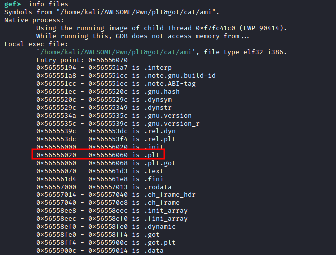

# Linux libraries part 1

# Linux libraries part 1
Dans cette partie 1 sur les librairies Linux, nous parlerons des binaires liés dynamiquement. Comment les symboles sont résolus dynamiquement. Le rôle du PLT & GOT et du linker.
<!--more-->

>## 0x0 Intro

Le binaire statiquement lié intègre toutes les bibliothèques dont il a besoin pour fonctionner au moment de la compilation, en revanche ce n'est pas le cas pour le binaire dynamiquement lié.

Reprenons l'image du [part0](https://w31rdr4v3n.github.io/fr/linux-libraries/).


Pour le statiquement lié, nous avons un call directe sur la fonction **printf**.

Désassemblons et regardons à l'intérieur.


Comme on peut le voir, nous avons évidemment le code du **printf**.


Quand est-il pour le binaire dynamiquement lié ?



```c
// ami.c
#include <stdio.h>
#include <stdlib.h>

int main(){

  printf("I'm _R4v3n");
  exit(0);
  return 0;
}
```

```sh
gcc -m32 -o ami ami.c
```


D'abord on peut constater qu'au lieu de **printf** on a **printf@plt**.

Désassemblons quand même et voyons ce qui s'y trouve.


Nous voyons que nous n'avons pas directement le code du **printf** mais un jump vers un emplacement suivi d'un push et d'un jump à la fin.


Alors comment le **printf** est résolu ?



>## 0x1 Le linker dynamique


Au démarrage d'un binaire ELF lié dynamiquement, le noyau charge l'image ELF du binaire dans la mémoire virtuelle de l'espace utilisateur.

Au chargement, une section .interp est détectée par le noyau.

Cette section contient le nom du chemin (path) d'un interpréteur de programme.

Il s'agit de l'éditeur de liens dynamiques, **/lib/ld-linux.so.2** dans mon cas sur l'image ci-dessus.

Affichons le contenu de la section .interp et voyons concrètement ce qu'elle contient.


Évidemment la section .interp contient le path de l'éditeur de liens dynamiques.

Le noyau démarrera l'éditeur de liens dynamiques, qui s'initialise et charge les objets partagés dont le binaire a besoin.

Affichons la liste des objets partagés dont le binaire a besoin avec la commande **ldd**.


Une fois que l'éditeur de liens termine son travail, le programme d'origine commence son exécution.

Au cours de l'exécution, l'éditeur de liens sera encore appelé pour la résolution de symbole.

En fait, tous les symboles ne sont pas résolus à l'exécution.

Tant qu'un symbole n'est pas réellement utilisé, il n'est pas résolu: on appelle ce processus le **Lazy binding**.

Quand une fonction est appelée pour la première fois, l'**éditeur de liens** recherche l'adresse de cette fonction dans la **libc** et fournie un mécanisme pour l'appel de la fonction: c'est ce qu'on appelle **relocation**.


Comment se déroule alors le processus de résolution de symbole ?


>## 0x2 PLT & GOT | relocation


Plusieurs sections interviennent dans ce processus de résolution.

* **.plt** : Procedure Linkage Table (table de liaison de procédures). 
        Elle est utilisée pour appeler des procédures/fonctions externes dont l'adresse n'est pas connue au moment de la liaison et doit être résolue par l'éditeur de liens dynamiques au moment de l'exécution. Ça contient un morceau de code qui recherche les adresses dans la section **.got.plt** et saute à la bonne adresse si l'adresse est déjà résolue, soit déclenche le code dans l'**éditeur de liens** pour rechercher l'adresse.

* **.got** :  Global Offset Table
        Il s'agit de la table réelle des décalages remplie par l'**éditeur de liens** pour les symboles externes.

* **.got.plt** : Il est également une partie de la **.got**.
          Il contient les adresses cibles (après qu'elles ont été recherchées) ou une adresse de retour dans le **.plt** pour déclencher la recherche.


Voyons un peu plus en pratique comment se passe la résolution du symbole et quel est le rôle de ces sections.

Prenons ce code

```c
// ami.c
#include <stdio.h>
#include <stdlib.h>

int main(){

  printf("I'm _R4v3n");
  return 0;
}
```
Compilons et débuggons avec GDB pour mieux voir.

```sh
gcc -m32 -o ami ami.c
```

Dans mon cas je vais utiliser le plugin [GEF](https://github.com/hugsy/gef).

Le main:


Puis un call sur **printf@plt**


L'adresse de notre call de **printf@plt** pointe dans la section **.plt**.

Autrement dit, l'adresse 0x1040 de **printf@plt** se situe dans la plage **0x00001020 - 0x00001060** qui est celle de la section **.plt**.

Le contenu de la section **.plt**:


La section .plt est composée de sous-sections qu'on peut appeler **entré**.

Ici nous avons 4 entrées: entrée 0, 1, 2, 3 composée chacune de trois instructions.

L'entrée 0 est un peu spéciale, les autres entrées suivent le même schéma: nous avons un **jump** suivi d'un **push** et d'un **jump**.

+ L'entre 2 pour **printf**

+ L'entre 3 pour **exit**

Au niveau de la première instruction de chaque entré, nous avons un jump vers un pointeur.

Le processeur déréférencera le pointeur et sautera à l'adresse obtenue.

Si on jette un petit coup d'oeil, on constate que ces adresses obtenues par déréférencement sont proches, y compris celui de l'entrée 0.

Pour ça, mettons un breakpoint au niveau du call de **printf@plt** et lançons le programme pour mieux voir.





Évidemment ces adresses sont proches **(0x56558ffc, 0x56559000, 0x56559004, 0x56559008)** et pointent toutes dans la section **.got.plt**.

Nous, notre call de **printf@plt** saute directement à l'adresse **0x56556040** dans la section .plt, suivons ça.

La première instruction est un jump dans le **.got.plt** à l'adresse **0x56556046** obtenu par déréférencement du pointeur **DWORD PTR [ebx+0x10]**.

Affichons ce qui se trouve à cette adresse obtenue.



$ebx+0x10 ----> 0x56559004 (got.plt) --> 0x56556046 (plt)


Nous pouvons constater qu'il s'agit de l'adresse de l'instruction suivante dans le **plt** : ``` 0x56556046 <printf@plt+6>:   push   0x8```

Autrement dit, ça nous ramène a l'instruction suivante.

Normalement nous devons obtenir l'adresse de **printf** à cette adresse **0x56559004** dans le **.got.plt** mais nous avons l'adresse de l'instruction suivante.


Vous vous êtes sans doute demandé pourquoi.


Si vous ne vous êtes pas posé la question alors ça ne fait rien.

Cela s'explique par le fait que nous n'avons jamais appelé **printf** avant et que nous devons déclencher la première recherche.

Je parle de la recherche de l'adresse de **printf** dans la **libc**, bien sûr.

Une fois à l'instruction suivante, l'offset **0x8** est poussés sur la pile.

Après ça, nous avons un jump à l'adresse **0x56556020**, ça nous amène à l'entrée 0 de **.plt**

À l'entrée 0, nous avons quatres instructions.


La premiere empile la valeur **0x56558ff8**, qui se trouve dans le **.got.plt** et qui pointe sur **0xf7ffd9e0** dans la section **.bss** du linker.


$ebx+0x4 ----> 0x56558ff8 (got.plt) --> 0xf7ffd9e0 (.bss in /lib/ld-linux.so.2)



À la deuxième instruction, nous avons un jump vers l'adresse **0xf7fdc1b0**, qui se trouve dans le **.text** du linker.


$ebx+0x8 ----> 0x56558ffc (got.plt) --> 0xf7fdc1b0 (.text in /lib/ld-linux.so.2)



Comme c'est la première fois qu'on appelle **printf**, l'**éditeur de liens(linker)** est appelé pour chercher l'adresse de **printf** et mettre à jour le **GOT**.

Jetons un coup d'œil dans cette section **.text** de l'éditeur de liens à partir de l'adresse obtenue.


Ce n'est pas vraiment la fonction de résolution des adresses mais elle appelle simplement la véritable fonction de résolution.


Comment sait-elle que c'est la résolution de **printf** mais pas de **scanf** ?


Pour le savoir, mettons un breakpoint à l'adresse **0xf7fdc1b0** dans le **.text** du **linker** et vérifions les valeurs passes en paramètres.


Nous avons deux valeurs intéressantes, l'adresse **0xf7ffd9e0** empilé à l'entrée 0 du **.plt** et l'offset **0x00000008** de **printf**.

Ces deux valeurs sont passées à la véritable fonction de résolution.

Nous pouvons vérifier les valeurs passées en paramètres à la véritable fonction grâce aux valeurs poussées sur la pile(esp+0x10, esp+0 xc).

Mettons un breakpoint sur la véritable fonction à l'adresse **0xf7fda520**, et vérifions si les valeurs sont bien passées.


Nous pouvons voir sur la pile nos deux valeurs.

Ainsi, grâce à l'offset **0x00000008** de **printf**, l'**éditeur de liens(linker)** saura mettre à jour le **.got.plt** pour le **printf**.

Nous n'irons pas bien loin dans cette fonction de résolution d'**éditeur de liens**, dans un autre chapitre nous en parlerons en détail.

Revenons dans la fonction **0xf7fdc1b0** et mettons un breakpoint juste après le call à l'adresse **0xf7fdc1c0**.


Une fois le **printf** résolu, il faut pouvoir s'en servir et continuer l'exécution.

c'est à ça sert le reste du code en quelque sorte.

**EAX** contient la valeur de retour de la véritable fonction de résolution, son contenu est poussé sur la pile à l'instruction : 
```0xf7fdc1c4  mov    DWORD PTR [esp], eax```


Il s'agit en fait de l'adresse de la fonction **printf** dans la **libc** : ainsi **printf** est bien résolu.

Puis après on change la valeur de **EAX** par l'adresse de la chaine de caractère **"I'm _R4v3n"** qui se trouve à l'offset 0x4 sur la pile, C'est la chaîne cible à imprimer.


Comme on a l'adresse de **printf**(dans la **libc**) sur la pile à l'offset **0x0**, si on fait un **ret**, cette adresse sera passée dans l'**EIP** et la fonction **printf** sera appelée directement.


Faisons un **ni** (next instruction) et vérifions la valeur de l'**EIP**.

Nous pouvons vérifier qu'on exécute dorénavant le **printf** depuis la **libc**.



Devrait-on répéter le même mécanisme de résolution avec chaque appel **printf**?


En vrai non.

Une fois qu'un symbole est résolu, ce processus de résolution ne sera pas répété pour le même symbole.

Pour cette raison le **.got.plt** sera mis à jour.

Revenons dans le **.plt**.


Avant ce **jump** nous amenait à l'instruction suivante car **printf** n'etais pas résolu mais maintenant ça amène directement dans le **.text** du **libc**(**/lib/i386-linux-gnu/libc.so.6**).

Si nous appelons à nouveau le **printf** dans le code, on ne fera plus appel au **linker** pour rechercher son adresse puisque son adresse est déjà disponible dans le **.got.plt**.

>## 0x3 Exploitation

  + [**GOT Overwrite**](datas/invisible.rar)
  + [**Ret2libc**](https://github.com/w31rdr4v3n/Binary-Exploitation/blob/main/ROP/rop_ret2libc.md)

# Références

[IBM : Anatomy of Linux dynamic libraries](https://developer.ibm.com/tutorials/l-dynamic-libraries/)

[Sections of an ELF File](https://docs.oracle.com/cd/E37838_01/html/E61063/elf-23207.html)

[Lazy Loading of Dynamic Dependencies](https://docs.oracle.com/cd/E23824_01/html/819-0690/chapter3-7.html)
