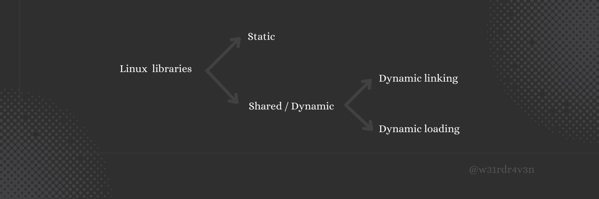
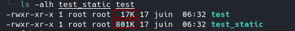
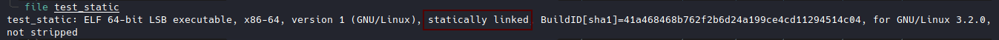
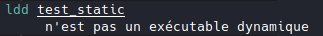

# Linux libraries part 0

# Librairies Linux part0
Dans cette série d'articles, j'expliquerai ce que j'ai compris des librairies Linux.
<!--more-->

Dans cette série d'articles, j'expliquerai ce que j'ai compris des librairies Linux.

Au début quand j'ai commencé le Buffer Overflow je me suis senti coincé car il me manquait des notions de base comme comment fonctionnent les librairies Linux, le PLT & GOT, le Linker dynamic, les objets partagés, etc ...

Alors j'ai cherché à comprendre et aujourd'hui je pensais écrire un article à ce sujet et y revenir plus tard si nécessaire et aussi si cela pouvait aider quelqu'un.


## C'est quoi une librairie ?

Lorsque vous codez en C, vous utilisez des fonctions comme **printf** pour imprimer ou **scanf** pour saisir, etc.
Ces fonctions, vous ne les avez pas codé vous même mais vous les utilisez.

Ou se trouve donc ces fonctions ?

Ces fonctions se trouve dans une librairie sur votre système.
Cette librairie est un ensemble de fonctions déjà précodées que vous n'avez plus besoin de recoder à chaque fois mais les utiliser directement. Vous allez donc gagner énormément de temps.

Ici j'ai pris l'exemple de fonction mais une librairie ne comporte pas uniquement de fonction, il y a aussi des variables, etc...

En bref, les librairies sont un moyen facile pour réutiliser le code.

Elles permettent de regrouper des fonctionnalités similaires dans une seule unité.
Ces unités permettent aux développeurs d'écrire leur code à partir de module: ce qu'on appelle la **programmation modulaire**.

Sous Linux, il y a deux types de librairie, les **librairies statiques** et les **librairies dynamiques** (librairie partagée).



##  Les librairies statiques


A ce niveau l'édition de liens est faite de manière statique.

C'est-à-dire, au moment de la compilation toutes les bibliothèques dont l'exécutable a besoin pour fonctionner sont intégrer à l'intérieur.


### Avantages:

> Tous les symboles sont résolus à l'exécution.
>
>Les appels fonction sont rapides.

Exemple:


### Inconvenients

>Les bibliothèques se trouvent dupliquer dans chaque exécutable.
>
>On utilise donc beaucoup d'espace sur la machine.
>
>Si on met à jour la fonction printf dans la librairie par exemple, il faut donc recompiler tous les exécutables.

Exemple:

test.c

```c
#include <stdio.h>
#include <stdlib.h>

int main(){

  printf("I'm _R4v3n");

  return 0;
}
```


```sh
gcc -o test test.c
gcc -static -o test_static test.c
```
**-static** pour compilier en mode statique.



Quand c'est statique la taille est élevée.

Ici, on a utilisé uniquement la fonction **printf**.

Au fur et à mesure que nous utiliserons des fonctions dans notre code, la taille de l'exécutable augmentera.


Pour vérifier si l'exécutable est statiquement liée.





##  Les librairies dynamique

Dans la prochaîne partie nous verrons les librairies dynamique.

Prérequis : Base en Assembleur, GDB


# References

[IBM : Anatomy of Linux dynamic libraries](https://developer.ibm.com/tutorials/l-dynamic-libraries/)

