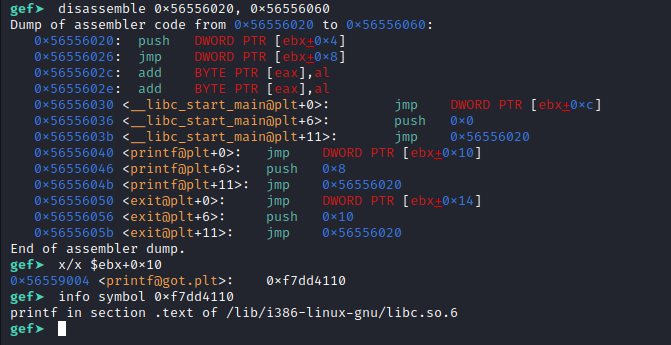

# Index

# Linux libraries part 1
In this part 1 about Linux libraries, we will talk about dynamically linked binaries. How symbols are dynamically resolved. The role of PLT & GOT and the linker.
<!--more-->

>## 0x0 Intro

The statically linked binary includes all the libraries it needs to work at compile time, but this is not the case for the dynamically linked binary.

Let's take the image of the part0 again.


For the statically linked, we have a direct call on the **printf** function.

Let's disassemble and look inside.


As you can see, we obviously have the **printf** code.


What about dynamically linked binary?



```c
// ami.c
#include <stdio.h>
#include <stdlib.h>

int main(){

  printf("I'm _R4v3n");
  exit(0);
  return 0;
}
```

```sh
gcc -m32 -o ami ami.c
```


First we can see that instead of **printf** we have **printf@plt**.

Let's disassemble it anyway and see what's there.


We see that we don't have the **printf** code directly but a jump to a location followed by a push and a jump at the end.


So how is the **printf** solved?



>## 0x1 The dynamic linker


When starting a dynamically linked ELF binary, the kernel loads the ELF image of the binary into the virtual memory of the user space.

On loading, an .interp section is detected by the kernel.

This section contains the path of a program interpreter.

This is the dynamic linker, **/lib64/ld-linux-x86-64.so.2** in my case on the picture above.

Let's display the content of the .interp section and see what it contains.


Obviously the .interp section contains the path of the dynamic link editor.

The kernel will start the dynamic linker, which initializes and loads the shared objects that the binary needs.

Let's display the list of shared objects that the binary needs with the **ldd** command.


Once the linker finishes its work, the original program starts running.

At runtime, the linker will be called again for symbol resolution.

In fact, not all symbols are resolved at runtime.

As long as a symbol is not actually used, it is not resolved: this process is called **Lazy binding**.

When a function is called for the first time, the **linker** looks for the address of this function in the **libc** and provides a mechanism for calling the function: this is called **relocation**.


How does the symbol resolution process work?


>## 0x2 PLT & GOT | relocation

Several sections are involved in this resolution process.

* **.plt** : Procedure Linkage Table. 
        It is used to call external procedures/functions whose address is not known at the time of binding and must be resolved by the **dynamic linker** at runtime. It contains a piece of code that looks for addresses in the **.got.plt** section and jumps to the correct address if the address is already resolved, or triggers the code in the linker to look for the address.

* **.got** :  Global Offset Table
        This is the actual offset table filled in by the **linker** for external symbols.

* **.got.plt** : It is also a part of the **.got**.
          It contains the target addresses (after they have been searched) or a return address in the **.plt** to trigger the search.


Let's take a closer look at how the symbol is resolved and what the role of these sections is.

Let's take this code

```c
// ami.c
#include <stdio.h>
#include <stdlib.h>

int main(){

  printf("I'm _R4v3n");
  return 0;
}
```
Let's compile and debug with GDB to see better.

```sh
gcc -m32 -o ami ami.c
```

In my case I will use the plugin [GEF](https://github.com/hugsy/gef).

The main:


Then a call on **printf@plt**


The address of our **printf@plt** call points to the **.plt** section.

In other words, the address 0x1040 of **printf@plt** is in the range **0x00001020 - 0x00001060** which is the range of the **.plt** section.

The content of the **.plt** section:


The **.plt** section is composed of sub-sections that can be called **entry**.

Here we have 4 entry: entry 0, 1, 2, 3 each composed of three instructions.

Entry 0 is a bit special, the other entry follow the same pattern: we have a **jump** followed by a **push** and a **jump**.

+ Entry 2 for **printf**

+ Entry 3 for **exit**

At the first instruction of each entry, we have a jump to a pointer.

The processor will dereference the pointer and jump to the address obtained.

If we take a look, we can see that these addresses obtained by dereferencing are close, including that of the 0 entry.

For that, let's put a breakpoint at the call of **printf@plt** and run the program to see better.


Obviously these addresses are near each other **(0x56558ffc, 0x56559000, 0x56559004, 0x56559008)** and all point to the **.got.plt** section.

We, our call from **printf@plt** jumps directly to the address **0x56556040** in the .plt section, let's follow that.

The first instruction is a jump in the **.got.plt** at address **0x56556046** obtained by dereferencing the pointer **DWORD PTR [ebx+0x10]**.

Let's display what is at this address obtained.



$ebx+0x10 ----> 0x56559004 (got.plt) --> 0x56556046 (plt)


We can see that this is the address of the next instruction in the **plt** : ``` 0x56556046 <printf@plt+6>:   push   0x8```

In other words, this brings us back to the next instruction.

Normally we should get the address of **printf** at this address **0x56559004** in the **.got.plt** but we have the address of the next instruction.


You may have wondered why.


If you haven't asked yourself that question then it doesn't matter.

This is because we have never called **printf** before and we need to trigger the first search.

I'm talking about looking up the address of **printf** in the **libc**, of course.

Once at the next instruction, offset **0x8** is pushed onto the stack.

After that, we have a jump to the address **0x56556020**, which brings us to the entry 0 of **.plt**

At entry 0, we have four instructions.


The first one stacks the value **0x56558ff8**, which is in the **.got.plt** and points to **0xf7ffd9e0** in the **.bss** linker section.


$ebx+0x4 ----> 0x56558ff8 (got.plt) --> 0xf7ffd9e0 (.bss in /lib/ld-linux.so.2)



On the second instruction we have a jump to the address **0xf7fdc1b0**, which is in the **.text** of the linker.


$ebx+0x8 ----> 0x56558ffc (got.plt) --> 0xf7fdc1b0 (.text in /lib/ld-linux.so.2)



Since this is the first time **printf** is called, the **linker** is called to look up the address of **printf** and update the **GOT**.

Let's have a look at this **.text** section of the link from the obtained address.


This is not really the address resolution function but simply calls the real resolution function.


How does she know that this is the resolution of **printf** but not **scanf**?


To find out, let's put a breakpoint at address **0xf7fdc1b0** in the **.text** of the linker and check the values passed in parameters.


We have two interesting values, the address **0xf7ffd9e0** stacked at entry 0 of **.plt** and the offset **0x00000008** of **printf**.

These two values are passed to the actual resolution function.

We can check the values passed as parameters to the real function thanks to the values pushed on the stack(esp+0x10, esp+0 xc).

Let's put a breakpoint on the real function at address **0xf7fda520**, and check if the values are passed.


We can see on the stack our two values.

Thus, thanks to the **0x00000008** offset of **printf**, the **linker** will know how to update the **.got.plt** for the **printf**.

We won't go too far into this **link** resolution function, in another chapter we will talk about it in detail.

Let's go back to the **0xf7fdc1b0** function and put a breakpoint just after the call at address **0xf7fdc1c0**.


Once the **printf** is solved, you must be able to use it and continue the execution.

That's what the rest of the code is for in a way.

**EAX** contains the return value of the real resolution function, its content is pushed on the stack with the instruction : 
```0xf7fdc1c4  mov    DWORD PTR [esp], eax```


It is in fact the address of the **printf** function in the **libc**: thus **printf** is well resolved.

Then we change the value of **EAX** by the address of the string **"I'm _R4v3n"** which is at offset **0x4** on the stack, this is the target string to print.


As we have the address of **printf** (in the **libc**) on the stack at offset **0x0**, if we do a **ret**, this address will be passed to the **EIP** and the **printf** function will be called directly.


Let's do a **ni** (next instruction) and check the value of the **EIP**.

We can check that the **printf** is now executed from the **libc**.



Should the same resolution mechanism be repeated with each **printf** call?


Actually no.

Once a symbol is resolved, this resolution process will not be repeated for the same symbol.

For this reason the **.got.plt** will be updated.

Let's go back to the **.plt**.



Before this **jump** brought us to the next instruction because **printf** was not solved but now it brings directly in the **.text** of the **libc**(**/lib/i386-linux-gnu/libc.so.6**).

If we call the **printf** again in the code, we will no longer call the **linker** to look up its address since its address is already available in the **.got.plt**.

>## 0x3 Exploitation

  + [**GOT Overwrite**](datas/invisible.rar)
  + [**Ret2libc**](https://github.com/w31rdr4v3n/Binary-Exploitation/blob/main/ROP/rop_ret2libc.md)

# References

[IBM : Anatomy of Linux dynamic libraries](https://developer.ibm.com/tutorials/l-dynamic-libraries/)

[Sections of an ELF File](https://docs.oracle.com/cd/E37838_01/html/E61063/elf-23207.html)

[Lazy Loading of Dynamic Dependencies](https://docs.oracle.com/cd/E23824_01/html/819-0690/chapter3-7.html)
