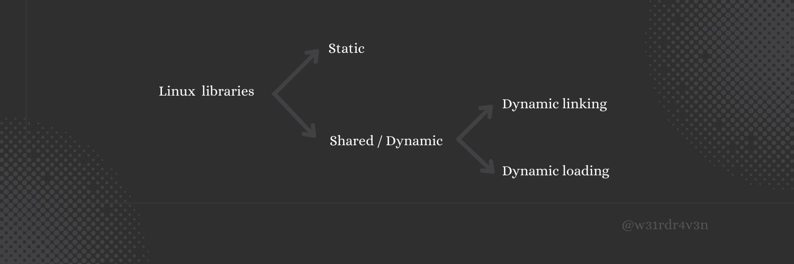
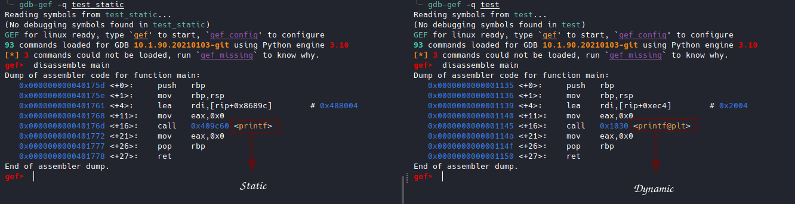
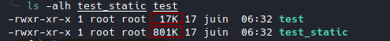
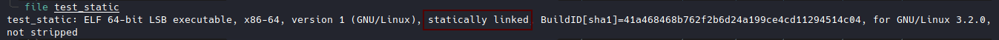
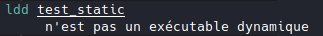

# Linux libraries


# Linux libraries part 0
<!--more-->

In this series of articles, I will explain what I understand about Linux libraries.

At the beginning when I started Buffer Overflow I felt stuck because I was missing some basic notions like how Linux libraries work, PLT & GOT, dynamic linker, shared objects, etc ...

So I tried to understand and today I thought I would write an article about it and come back later if necessary and also if it could help someone.


## What is libraries ?

When you code in C, you use functions like **printf** to print or **scanf** to type, etc.
These functions, you didn't code them yourself but you use them.

Where are these functions?

These functions are in a library on your system.
This library is a set of pre-coded functions that you don't need to recode each time but use them directly. You will save a lot of time.

Here I took the example of function but a library does not contain only function, there are also variables, etc...

In short, libraries are an easy way to reuse code.

They allow similar functionality to be grouped together in a single unit.
These units allow developers to write their code from modules: this is called **modular programming**.

Under Linux, there are two types of libraries, the **static libraries** and the **dynamic libraries** (shared libraries).



##  Static libraries


At this level the editing of links is done in a static way.

That is, at compile time all the libraries that the executable needs to run are integrated inside.


### advantage:

> All symbols are resolved at runtime.
>
>The function calls are fast.

Example:




### Disadvantages

>The libraries are duplicated in each executable.
>
>So we use a lot of space on the machine.
>
>If you update the **printf** function in the library, for example, you have to recompile all the executables.

Example:

test.c

```c
#include <stdio.h>
#include <stdlib.h>

int main(){

  printf("I'm _R4v3n");

  return 0;
}
```


```sh
gcc -o test test.c
gcc -static -o test_static test.c
```
**-static** to compile in static mode.



When it is static the size is high.

Here we have used only the **printf** function.

As we use more functions in our code, the size of the executable will increase.


To check if the executable is statically linked.





##  Dynamic libraries

In the next part we will see the dynamic libraries.

Prerequisites: Basic assembly, GDB


# References

[IBM : Anatomy of Linux dynamic libraries](https://developer.ibm.com/tutorials/l-dynamic-libraries/)

